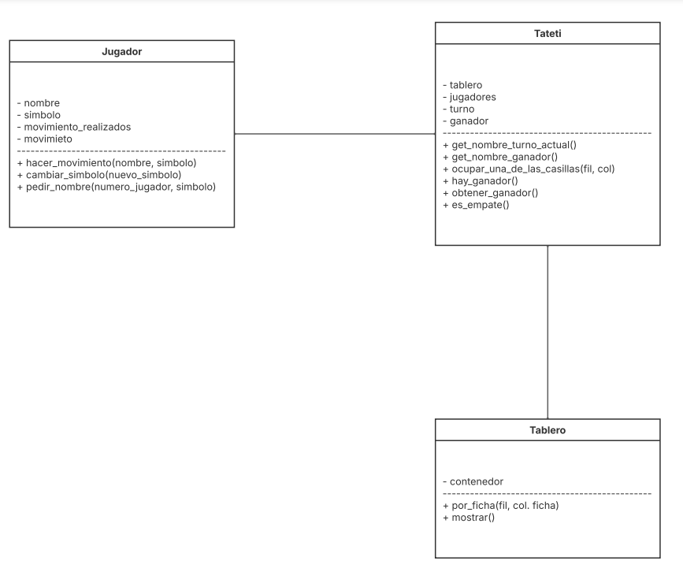

## 👤 Información del Alumno

### 📋 Datos Personales
- **Nombre y Apellido**: Matías Zarzur
- **Ciclo Lectivo**: 2025
- **Carrera**: Ingeniería en Informática
# Como ejecutar el sistema y pruebas:
```bash
#sistema
python -m src.cli
#ejecutar todas las pruebas
python -m unittest discover -s test -v
```

# Diagrama


# Explicacion
Como se puede observar en el diagrama el tateti esta compuesto por tres clases principales:
La clase jugador representa a cada participante del juego y contiene atributos como el nombre, el simbolo que usa y los movimientos. Tambien incluye metodos para cambiar solicitar el nombre, registrar movimientos y el simbolo

Por otra parte, la clase Tablero se encarga de modelar justamente el tablero de juego. Su atributo principal es contenedor, que almacena el las casillas. A través de sus métodos se pueden colocar fichas en posiciones determinadas y mostrar gráficamente el tablero.

Finalmente, la clase Tateti actua como el controlador del juego, ya que conecta a los jugadores con el tablero. Sus atributos mantienen el estado del turno y verifican si hay un ganador o si la partida finalizó en empate. Sus métodos permiten gestionar los turnos, validar las jugadas y comprobar las condiciones de victoria.

Todo esto se ejecuta a taves de una interfaz de linea de comandos (CLI) donde se imprime el tablero en cada turno, se solicita la posicion de la ficha a taves de cordenadas y se contrala el flujo del juego.

# Estructura del Proyecto
src/
models(jugador.py, tablero.py, tateti.py )     
cli.py              

test/
test_jugador.py     
test_tablero.py     
test_tateti.py      